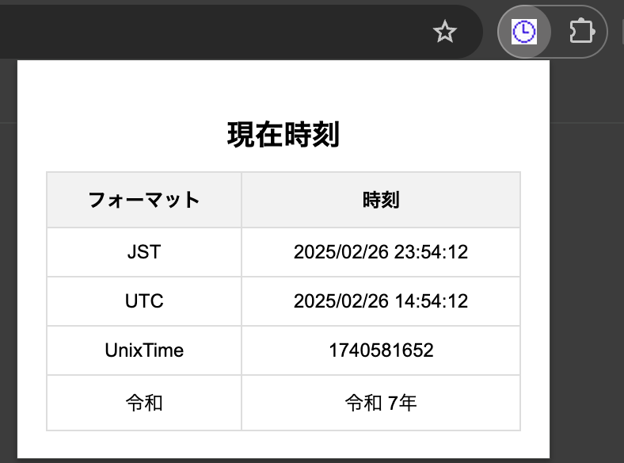

# What Time Is It Now ?

## 概要

wtiinは、現在時刻を表示するためのChrome拡張機能です。  
ブラウザツールバーの本拡張機能アイコンをクリックするだけで現在時刻がポップアップで表示されます。

この拡張機能では、以下の4種類の形式で現在時刻を表示します。

- **日本標準時 (JST):** 日本の現地時間で表示します。
- **世界標準時 (UTC):** 協定世界時で表示します。
- **UnixTime:** 1970年1月1日からの経過秒数で表示します。
- **和暦 (令和):** 現在が令和何年かを表示します。


## インストール

1. リポジトリをクローンします:
    ```bash
    git clone https://github.com/foresukecom/wtiin.git
    ```

2. Chromeを開き、[chrome://extensions/](chrome://extensions/)にアクセスします。

3. 右上の「デベロッパーモード」を有効にします。

4. 「パッケージ化されていない拡張機能を読み込む」をクリックし、クローンしたリポジトリのディレクトリを選択します。

## スクリーンショット



## ライセンス

このプロジェクトは MIT ライセンスの下で提供されています。  
詳細については [LICENSE](LICENSE) ファイルをご確認ください。

## 貢献

このプロジェクトへの貢献を大歓迎します！  
ご意見や改善案、バグ報告、機能追加の提案など、どんな貢献も歓迎しています。  
貢献を希望される場合は、以下の手順に従ってください。

1. **Issue の作成**  
   まずは Issue を作成し、変更内容や提案内容についてディスカッションしてください。

2. **プルリクエストの提出**  
   修正や機能追加が完了したら、プルリクエストを提出してください。  
   コードの可読性やテストの追加、ドキュメントの更新を心がけていただけると助かります。

皆様のご協力をお待ちしております！
